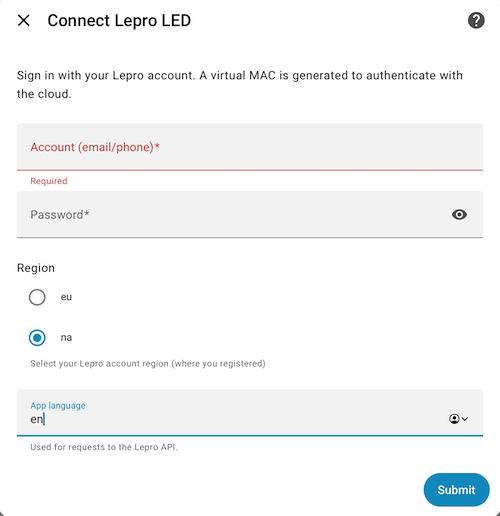

# Lepro LED (Home Assistant Custom Integration)

Monitor and control your **Lepro LED** devices from Home Assistant.  
This custom integration logs in to **Lepro Cloud**, retrieves your lights and strips, and exposes them as controllable lights in HA.

  
  

> ⚠️ This is a third‑party project, not affiliated with Lepro.

---

## ✨ Features

- Login with your **Lepro** account (email + password).  
- Automatically discovers all **Lepro lights and strips** in your account.  
- Sensors for:
  - Connection state and online/offline status
  - Device model, firmware, and MAC address
  - Brightness, color temperature, and RGB values
- Turn lights **on/off**, set **brightness**, **color**, and **effects**.  
- Automatic token renewal to maintain connectivity.

---

---

## 🔧 Installation

### Option A — HACS (recommended)
1. Make sure you have [HACS](https://hacs.xyz/) installed in Home Assistant.
2. In Home Assistant: **HACS → Integrations → ⋮ (three dots) → Custom repositories**.  
   Add `https://github.com/advenimus/lepro_led` as **Category: Integration**.
3. Find **Lepro LED** in HACS and click **Download**.
4. **Restart** Home Assistant.

### Option B — Manual
1. Copy the folder `custom_components/lepro_led` from this repository into your Home Assistant config folder:
   - `<config>/custom_components/lepro_led`
2. **Restart** Home Assistant.

---

## ⚙️ Configuration

1. Home Assistant → **Settings → Devices & services → Add Integration**.
2. Search for **Lepro LED**.
3. Enter your **Lepro email and password**.
4. On success, entities will be created for each device.

### Entities
- **Lights**: control on/off, brightness, color temperature, RGB color, effects.
- **Sensors**: connection status, device model, firmware, MAC, online/offline.
- **Buttons**: (if applicable, e.g., factory reset or effect presets).

> Notes:
> - Credentials are stored in Home Assistant’s config entries.
> - The integration communicates with Lepro’s cloud API (internet required).

---

## 🧪 Supported versions
- Home Assistant: **2024.8** or newer (earlier may work, untested).

---

## 🐞 Troubleshooting
- Check **Settings → System → Logs** for messages under `custom_components.lepro_led`.
- If login fails, verify email/password by signing into the official Lepro app.
- If entities don’t update, ensure Home Assistant can reach the internet.

---

## 🙌 Contributing
PRs and issues are welcome. Please open an issue with logs if you hit a bug.

---

## ❤️ Donate
Don't bother, something this simple should be free lol
---

## 📜 License
[MIT](LICENSE.md)

